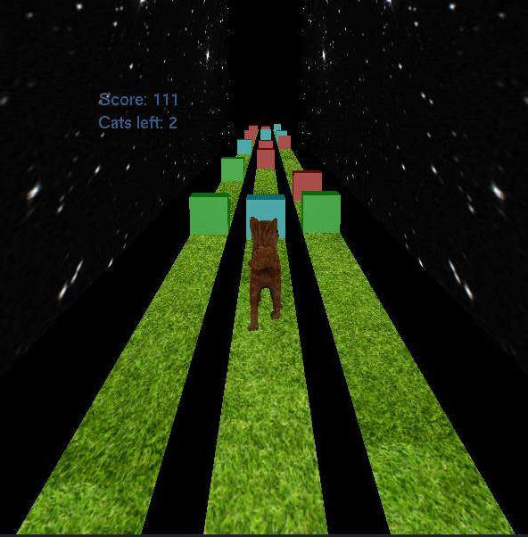

# Parkour Game Project
Team members:
- Jianlan Ding 
- Zicheng Guo
- Hanjie Xu
- Kaicheng Xu

## How to run
1. Simple download everything from my repo.(be aware of directory, main.cpp is not in the src) 
2. Make sure you are in the same directory as makefile. 
3. Then just type 'make'.

## Description
This is a Parkour game similar to Chameleon Run, which requires concentration and agility. The Basic idea is that you can control a player to run on the lanes. You are able to control the player to switch between the three lanes. The obstacles generated ahead may be in three different colors. You can change the color of the score on the top left corner. The player has in total three health points. Each time the player pass the obstacle and the color of the score is not the same as the obstacle, it will lose one health point. When the player hits an obstacle of the same color, it will directly pass through the obstacle. If the player loses all the health points, the game is over.  

The longer distance the player runs, the higher the score is.

## Content
This prototype includes the following:
1. Starry sky background
2. Grass Textrue for lanes
3. GUI interface(starting game, end game etc.)
4. Materials for obstacles
5. Display the counting score
6. Cat animation (moving)

## Interface
| Command  | Description  |
|---|---|
| q, Q  | quit  |
| p, P  | pause the game  |
| r, R  | restart the game  |
| a, A, LeftArrow  | move the player to the left lane |
| d, D, RightArrow  | move the player to the right lane  |
| n, N | change to first person view |
| space  | jump  |   
| 1  | change the score color to red  |   
| 2  | change the score color to green  |   
| 3  | change the score color to blue  |   

## Notice:
Everything should compile just fine without any errors.

## Project References: 
cat obj: https://free3d.com/3d-model/cat-v1--522281.html  
Cube.obj: referred from www.blender.org.  
PPM loader from tutorial files.
tutorial number t files

 
