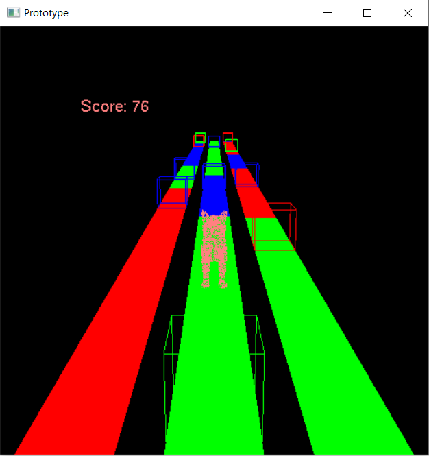

# Team 17 3GC3 Project Prototype
Team members:
- Jianlan Ding 
- Zicheng Guo
- Hanjie Xu
- Kaicheng Xu

## How to run
Simple download everything from my repo.(be aware of directory, main.cpp is not in the src) Make sure you are in the same directory as makefile. Then just type 'make'.

## Description
This is a Parkour game similar to Chameleon Run, which requires concentration and agility. 
The Basic idea is that you can control a player to run on the lanes. You are able to control the player to switch between the three lanes. The color of the lanes generated ahead may be in different colors. You can change the color of the player by pressing number keys. If the color of player is not the same as the lane it is on, it will fall out and fail the game. There will also be randomly generated obstacles on the lanes for you to dodge. If the player hits the obstacle, it will also lose. The longer distance the player runs, the higher the score is.

## What have we implemented in prototype
- generate world, there are 3 lanes, each lane contains many colours(red, green, blue)
- is able to let player swith between lanes
- the cat(from obj file) can change its colour
- the obstacle, if the cat hit it, the game would restart
- restart the game
- pause the game

## Content
This prototype includes the following:
• The obj file of the player.
• The *.obj file parser.
• The obj file of the player.
• An object class, which is a general class of player, obstacle and lane
• A player class.
• An obstacle class.
• A lane class.
• A utility class.
• A light class.
• Basic keyboard controls.

## Interface
| Command  | Description  |
|---|---|
| q, Q  | quit  |
| p, P  | pause the game  |
| r, R  | restart the game  |
| left arrow  | move the player to the left lane |
| right arrow  | move the player to the right lane  |
| space  | jump  |   
| 1  | change the player's color to color 1  |   
| 2  | change the player's color to color 2  |   
| 3  | change the player's color to color 3  |   

## Notice:
Currently, the total lane distance is fixed, and the player can jump multiple times once. These could be changed later. We are still need to implement the colour detection.

## Project References: 
cat obj: https://free3d.com/3d-model/cat-v1--522281.html
Cube.obj: referred from www.blender.org.

 
 

 
