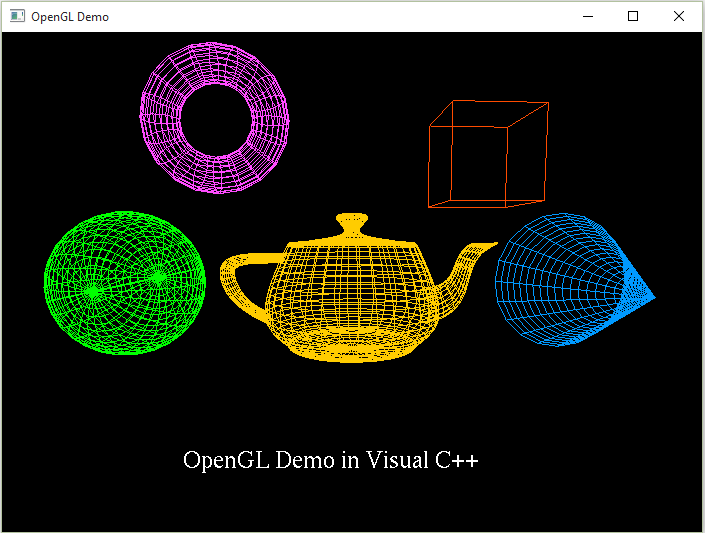

# Computer Graphic Design

## Personal Infos
- Name: Jianlan Ding
- email: dingj29@mcmaster.ca
- user dingj29
## About 3D computer graphic
- Concepts include: Mathematical foundations, the graphics pipeline, geometrical transformations, 3D visualization, illumination and shading models and etc.
- Projects are built using on OpenGL and C++.
- Common Features include: Scene Object Structure & Rendering, Mouse Ray Picking, Camera Control, Lighting, Material, Texture Mapping, Load & Save, Subsequent Interactive Manipulation of Objects(i.e. Transformation, Scaling, Rotation) and other Custom Features.

## Platform & Software
- OS: Windows 10
- Visual Studio 2019, Clion
- MinGW 64-bits

## Projects List (built using OpenGL&C++)
- Drawing Tool
- 2D Particle System
- 3D Particle System
- 3D Modeling System(Object Modeler)
- 3D Parkour Game

 
